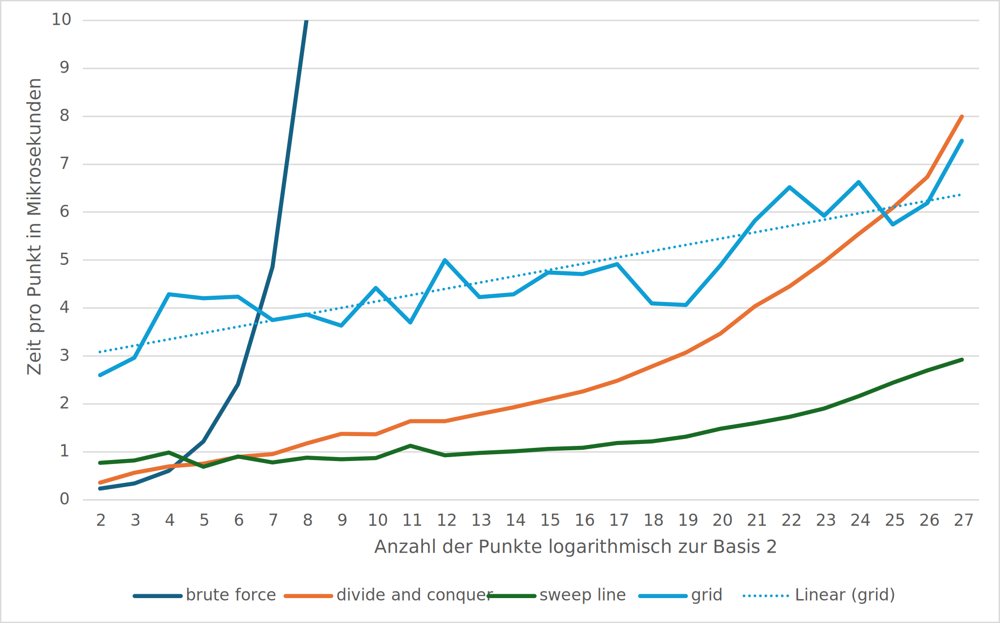

# closest pair

This to a repo to compare different algorithms that find the closest pair in a set of points.

## preliminary results

Preliminary results were executed unoptimized with points consisting of f64 numbers. The results show the strong quadratic increase of the brute force alogrithm, the flatter curve of divide and conquer and sweep line, as well as the strongly fluctuating curve of the grid alogrithm.